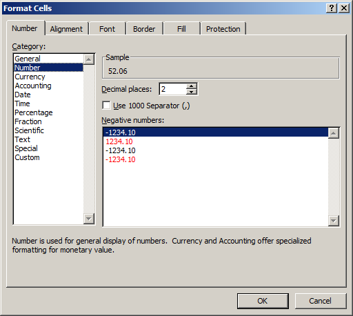
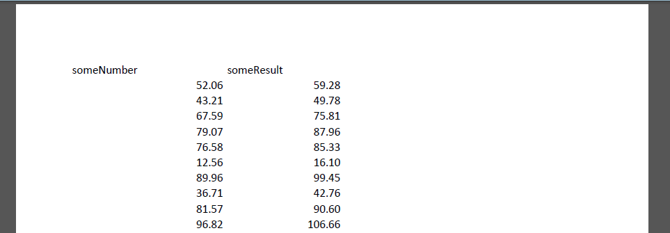

Earlier this week the National Archives of the Netherlands (NANeth) published a [report on preferred file formats](http://www.nationaalarchief.nl/sites/default/files/docs/na_rapport_voorkeursformaten-web_0.pdf). It gives an overview of NANeth's 'preferred' and 'acceptable' formats for 9 content categories, and also explains the reasoning behind the selected formats. Even though in Dutch language only, the report is well worth a look. However, I found a few of the choices a little surprising, especially the 'spreadsheet' category for which it lists the following preferred and acceptable formats:

|Preferred|Acceptable|
|:--|:--|
|ODS, CSV, PDF/A|XLS, XLSX|

Using *PDF/A* as a preferred format for spreadsheets seems an odd choice for a number of reasons. I'll try to explain the main ones in the remainder of this blog post.

## Demo spreadsheet

To illustrate my points I created a [simple demo spreadsheet](https://github.com/bitsgalore/spreadsheetsPDF/raw/master/demoNumbersCalculations.xlsx) in xlsx format (created in Microsoft Excel 2010). It contains two columns:

* Column A: random number between 0 and 100 (as static values)
* Column B: formula that takes the value from Column A and adds its square root:

    `=A3 + SQRT(A3)`

## Displayed precision not equal to stored precision

Without applying any special formatting, this is what the spreadsheet looks like in MS Excel 2010:

The first thing of interest here is that the displayed values in the cells are different from those that are actually stored! For example, the value that is shown in cell A1 is:

     52.06077146 

Note that 8 decimal places are shown. But by looking at the formula bar you can see a different value:

     52.0607714623856 

which contains 13 decimal places. Since Excel internally [stores numbers at a precision of 15 significant figures](https://en.wikipedia.org/wiki/Numeric_precision_in_Microsoft_Excel), only the latter corresponds to the actual (stored) value.

## Exporting to PDF/A

I exported the spreadsheet to PDF/A-1a using Acrobat PDFMaker. The result can be found [here](https://github.com/bitsgalore/spreadsheetsPDF/raw/master/demoNumbersCalculations.pdf). Below is what the PDF looks like when opened in Adobe Acrobat:

So, the PDF only contains the values at Excel's displayed precision (in this case typically 9-10 significant figures), and the remaining precision got lost in the conversion[^1]. 

In addition, unlike the source spreadsheet, the PDF *only* contains static numbers. This means that information about the relation between the values in Columns A and B (i.e. the formula) is completely lost.  

## Effect of cell formatting

A possible way around the rounding issue would be to use Excel's *Format Cells* dialog, which allows one to set a fixed number of decimal places to be used for display:

  

This is also less than ideal, if only for the reason that a fixed value will result in the display of non-significant figures. For example, applying a setting of 14 decimal places to the value in cell A1 results in:

     52.06077146238560

which is different from the stored value:

     52.0607714623856 

Moreover, this approach would be extremely cumbersome for spreadsheets that contain numbers at different precisions (e.g. it is pretty common to have one column with integer values, and another one with floating-point numbers).

In practice, Excel's number formatting is often used to *reduce* the number of displayed digits (e.g. to make the columns more visually pleasing, or to avoid messy output when printing). [Here's a version of the spreadsheet](https://github.com/bitsgalore/spreadsheetsPDF/raw/master/demoDisplay2DigitsOnly.xlsx) where I adjusted the formatting to display two decimal places only, and [here is the resulting PDF](https://github.com/bitsgalore/spreadsheetsPDF/raw/master/demoDisplay2DigitsOnly.pdf). It looks like this: 

  

So in this case even more information is lost!

## Interactive or dynamic? 

The preferred formats document does acknowledge that PDF/A may not always be suited for spreadsheets, using the following statement (in Dutch):

> Let wel: bepaalde (interactieve) functionaliteit zal na omzetting naar PDF/A formaat niet meer beschikbaar zijn. Als deze functionaliteit als essentieel wordt beschouwd, is dit een reden om niet voor
PDF/A te kiezen 

Which translates in English as:

> Note: some (interactive) functionality will not be available after conversion to PDF/A. If this functionality is deemed essential, this will be a reason for not choosing PDF/A

This statement is problematic for various reasons. First, whether functionality is deemed 'essential' largely depends on the context and intended user base. By stessing the *interactive* aspect, the authors imply (perhaps unintentionally?) that any spreadsheets that do not take any interaction with a user can be safely converted to PDF/A. But what does 'interactive' mean in this context? Taking my earlier [sample spreadsheet](https://github.com/bitsgalore/spreadsheetsPDF/raw/master/demoNumbersCalculations.xlsx) as an example: a user may 'interact' with that spreadsheet by changing the values in Column A, after which all values in Column B are recalculated. Does that make it interactive? If yes, applying the 'interactivity' criterion like this would cover *any* spreadsheet for which the value in any cell is dependent on one or more values in other cells. This applies to most spreadsheets, apart from those that only contain static data. But in that case a distinction between 'static' and 'dynamic' spreadsheets might be more useful[^2].

## Reading PDF/A spreadsheets

Finally, I'm quite puzzled how a PDF/A representation of a spreadsheet is meant to be read. Who are the intended users? What is the target software? Sure enough a PDF may be sufficient for on-screen viewing, but what if a (future) user wants to recover the original row and column values? Excel is not capable of this (it cannot import a PDF at all), and besides that the lack of structure of the PDF format makes this notoriously difficult[^3].  

To be clear: there may be situations where *PDF/A* is a good (and possibly even the best) choice for spreadsheet content. For example, spreadsheets are often used for printable forms, and having these as a PDF/A representation may be perfectly fine. I'm 

[^1]: Incidentally the same happens when exporting to CSV! See [this file](https://github.com/bitsgalore/spreadsheetsPDF/blob/master/demoNumbersCalculations.csv).

[^2]: On a related note, it is well known that (formulae in) spreadsheets often contain errors, and that these can have major implications (there are numerous examples on the [*Horror Stories* section](http://www.eusprig.org/horror-stories.htm) of the [European Spreadsheet Risks Interest Group ](http://www.eusprig.org/)). Once converted to PDF/A, such errors are impossible to detect. 
 
[^3]: Andy Jackson once compared this to ["reconstructing the cow from the burger"](https://twitter.com/anjacks0n/status/471242447813898242)