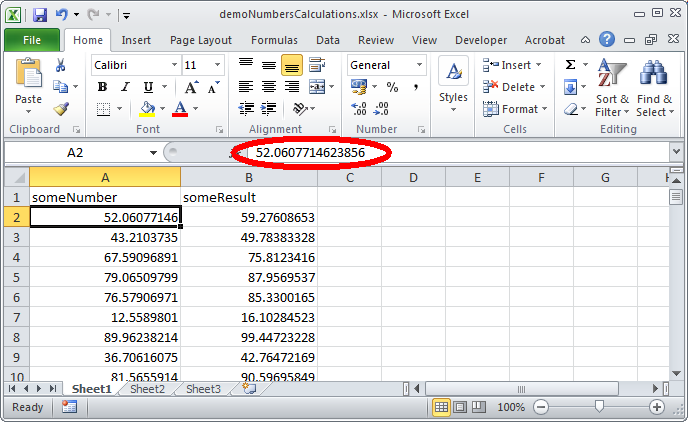
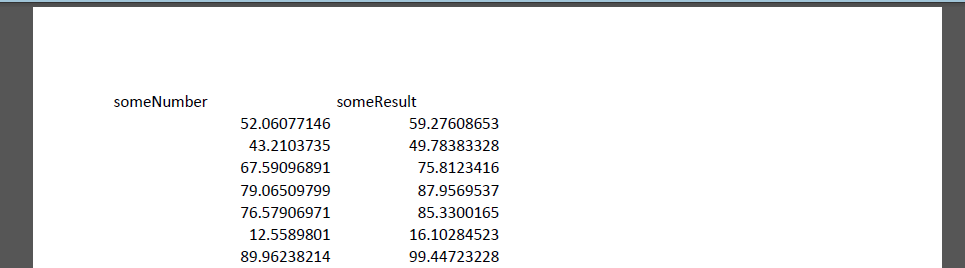

* Column A: random number between 0 and 100
* Column B: formula that takes the value from Column A and adds its square root:

    `=A3 + SQRT(A3)`

Without applying any special formatting, this looks as follows in MS Excel 2010:
<!--
||A|B|
|:--|:--|:--|
|**1**|someNumber|someResult|
|**2**|52.06077146|59.27608653|
|**3**|43.2103735|49.78383328|
|**4**|67.59096891|75.8123416|
-->

The first thing of interest here is that the values that appear in the cells are different from those that are actually stored! For example, the value that is shown in cell A1 is 52.06077146 (8 decimal places). But by looking at the formula bar you can see a value of 52.0607714623856 (13 decimal places). Since Excel internally stores numbers at a precision of 15 significant figures, only the latter corresponds to the actual (stored) value.

I exported the spreadsheet to PDF/A-1a using Acrobat PDFMaker. The result can be found [here](). Below is what the PDF looks like when opened in Adobe Acrobat:

So, the PDF only contains the values at Excel's displayed precision (in this case typically 9-10 significant figures), and the remaining precision got lost in the conversion. 

  

2.41835460989231 15
2.41835461  9
